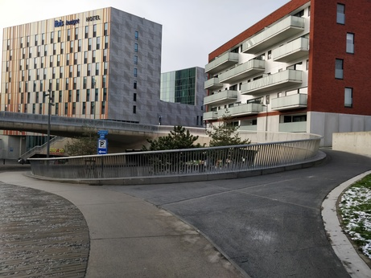

## Accessibility Statement

Heart of Clojure is an inclusive conference and as such strives to be accessible to everyone. This includes:

- Ensuring our venues are accessible by wheelchair.
- Making sure that maps and orientation material is available.
- Providing clear signage to, from and through the building.
- Providing complimentary tickets for assistants for disabled participants.
- Serving a wide range of food and special requests.
- Sadly, only guide animals are allowed at the venue.

Our goal is that the conference and all other related events are accessible to
disabled people. However, we are aware that accessibility issues are diverse and
we may not have everything covered off in our plans - please reach out, and we
will do our very best to confirm we have those requirements under control. Send
a mail to [orga@heartofclojure.eu](mailto:orga@heartofclojure.eu).

We will happily reserve you a ticket if it’s not immediately clear whether
necessary assistance is provided or you have additional planning to do for your
trip to Heart of Clojure.

### Getting to the venue

The main way to reach the venue is through Leuven train station, which is at
walking distance, and is a 15 minute train ride from Brussels airport. These
instructions walk you through how to get from the station to the venue
barrier-free.

When you arrive at Leuven station, take the elevator from the platform up to the
pedestrian bridge.

<!--  -->

When you come out of the elevator turn left towards the back side of the station.

<!--  -->
<!--  -->

Exit the station and continue until you get to the sidewalk, passing in between two buildings.

<!--  -->
<!--  -->
<!--  -->

Turn left and follow the sidewalk until you get to a pedestrian crossing.

Cross the street, then take the sidewalk on the other side. You are now above
the pedestrian tunnel that runs underneath Leuven station.

Continue along the sidewalk to get to the other side of the tunnel.

Here turn right to take the ramp that leads down towards the tunnel entrance.

Follow the path that leads away from the station. There will be one street to cross, continue on straight, the venue is on your left.

Enjoy the conference!

